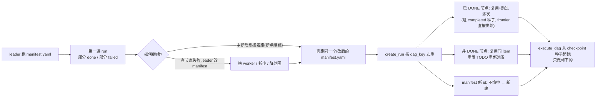
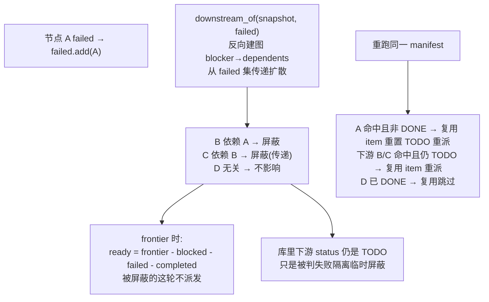
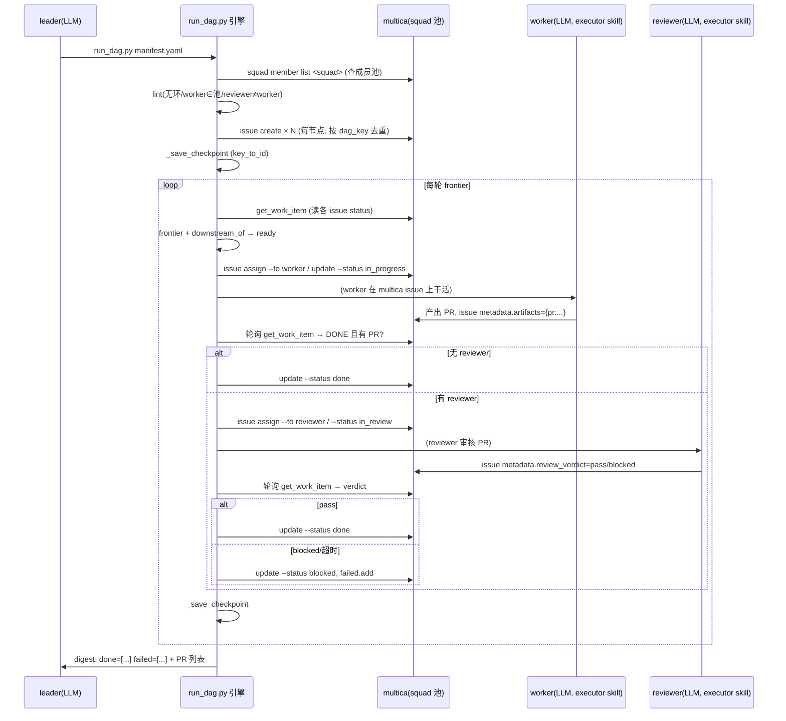

# parallel-dev-orchestration 执行机制与流程

> 本文是 orchestrator skill（`parallel-dev-orchestration`）的机制说明，配合 `scripts/` 下的编排引擎阅读。
> 目的：不读代码也能 get 到整个 DAG 是怎么被拆出来、跑起来、失败重试、幂等重跑的，以及每个状态是谁在什么时候更新的。
> 配套的 worker/reviewer 执行协议在 `parallel-dev-executor` skill。

---

## 1. 三个角色与边界

| 角色 | 载体 | 职责 | 不做什么 |
|------|------|------|----------|
| **leader** | `parallel-dev-orchestration` skill 正文（LLM 动态） | 把任务拆成 manifest DAG、决策失败、改 manifest 重跑、收尾汇报 | 不写循环、不派单、不写派发判定 |
| **编排引擎** | `scripts/run_dag.py` + `scripts/core/` + `scripts/engines/`（确定性代码） | lint、建/复用 work item、编译 metadata、算 frontier、派发、轮询、失败隔离、持久化 | 不决策「换谁」「拆多大」 |
| **worker / reviewer** | `parallel-dev-executor` skill（LLM 动态） | 在协作平台（如 multica）上执行被派的 issue，产出 PR、走审核、回写产物/verdict | 不改 manifest、不调度别人 |

一句话：**引擎只做确定性的事（派谁、轮询、标状态、隔离），leader 只做动态判断（拆解质量、失败原因、改派策略），worker 只做被派的活。**

唯一的 CLI 入口是 `python scripts/run_dag.py <manifest>`。leader 不直接操作底层引擎 CLI（multica / gh），那些都封在引擎里。

---

## 2. 核心数据模型

### 2.1 WorkItem（一个 DAG 节点 = 一个协作平台工作单元 = multica 的一个 issue）

字段里和流程强相关的几个：

- `id`：协作平台上的实际 id（multica 的 issue number）
- `dag_key`：**manifest 节点的 `id`**（如 `jwt-service`）——幂等去重的主键
- `title`：`[DAG:<dag_key>] <node.title>`
- `worker` / `reviewer`：派给谁
- `blocked_by`：DAG 依赖（其它节点的 dag_key 列表）
- `artifacts`：worker 回写的产物，如 `{"pr": "https://.../pull/123"}`——**是否有 PR 是完成判定的硬条件**
- `review_verdict`：reviewer 回写，`pass` / `pass-with-nits` / `blocked` / `needs-changes`
- `status`：见下面状态机

### 2.2 WorkItem 状态机

```
                 ┌──────────────────────────────────────────┐
                 ▼                                          │
  TODO  ──assign worker──▶  IN_PROGRESS  ──worker 跑完+有PR──▶ 无 reviewer：DONE
                                │                          │
                                │ worker 失败              │ 有 reviewer
                                ▼                          ▼
                              FAILED(瞬态)              IN_REVIEW ──assign reviewer──▶ 轮询 verdict
                                │                                       │
                                │ 引擎判定失败                        ├─ pass / pass-with-nits ─▶ DONE
                                ▼                                       └─ blocked / needs-changes / 超时 ─▶ BLOCKED
                              BLOCKED ◀──引擎标(失败隔离)
```

**关键区分**：

- `DONE` = 成功终态。是幂等去重里「**复用、跳过派发**」的唯一判定状态。
- `BLOCKED` = 失败终态（引擎标）。该节点的下游会被一并标 blocked（失败隔离）。重跑时被视为「非 DONE → 重置 TODO 重派」。
- `FAILED` 是 worker 自己报的瞬态，引擎拿到后会把它转成 `BLOCKED` 计入 failed —— 实际跑完后落库的失败终态是 `BLOCKED`。
- `IN_PROGRESS` / `IN_REVIEW` 是在飞态，frontier 不算它们 ready，重跑时也归「非 DONE → 重派」。

> 注：之前有过一个 `NEEDS_REASSIGN`「待改派」状态，已 revert 掉——因为它在运行意义上和「失败→改 manifest→重跑」等价，统一进失败重试，不另设状态。

### 2.3 Run（一次 run_dag.py 执行 = 一个 Run）

- `id`：`dag-<时间戳>-<随机>`，每次 `create_run` 生成一个**新** run_id（重跑也是新 run）
- `status`：`RUNNING` / `COMPLETED` / `FAILED`（`PAUSED` 预留未启用）
- `total_tasks` / `completed_tasks` / `failed_tasks`：从 checkpoint 算实时进度
- 持久化：mock 落到 `.multica_state/<run_id>/`（`run.json` + `manifest.yaml` + `checkpoint.json` + `events.jsonl`）；multica 落到 orchestrator issue 的 metadata + 附件

**checkpoint** 是幂等的关键载体：`{"key_to_id": {dag_key: item_id}, "completed": [...], "failed": [...]}`。每次节点状态变更后引擎自动 `_save_checkpoint`。

---

## 3. 状态更新点（谁、什么时候、改什么）

这是「不用看代码也知道状态怎么流转」的速查表。所有写操作都是引擎在 `execute_dag` 里做的，worker/reviewer 只回写 `artifacts` 和 `review_verdict`，状态标定权在引擎。

| 时机 | 操作 | 状态变化 | 谁写的 |
|------|------|----------|--------|
| `create_run` 建新节点 | 新建 work item | → `TODO` | 引擎 |
| `create_run` 命中已 DONE 节点 | 复用，不动 | 保持 `DONE` | 引擎 |
| `create_run` 命中非 DONE 节点 | 复用同 item，清产物/verdict | → 重置 `TODO` | 引擎 |
| 派发 worker 前 | `update_status` | `TODO`→`IN_PROGRESS` | 引擎 |
| worker 完成、`get_work_item` 查到 `DONE` 且有 PR 产物 | 判定成功 | 保持 `DONE`（worker 已写） | worker 写 status，引擎确认 |
| worker 完成、缺 PR 产物 | 判定失败 | 引擎标 `BLOCKED`，`failed.add(key)` | 引擎 |
| worker 报 `FAILED` | 判定失败 | 同上 | 引擎 |
| 派发 reviewer 前 | `update_status` | `IN_PROGRESS`/`DONE`→`IN_REVIEW` | 引擎 |
| reviewer verdict∈{pass,pass-with-nits} | 通过 | → `DONE`，`completed.add(key)` | 引擎 |
| reviewer verdict∈{blocked,needs-changes} 或审核超时 | 拒绝 | → `BLOCKED`，`failed.add(key)` | 引擎 |
| 无 reviewer 节点 worker 成功 | 直接完成 | → `DONE`，`completed.add(key)` | 引擎 |
| 任一失败发生 | 失败隔离 | `downstream_of(failed)` 的下游标 `BLOCKED`（懒计算，不入 failed） | 引擎（frontier 时计算） |
| 每次 completed/failed 变更后 | `_save_checkpoint` | 落盘 completed/failed 列表 | 引擎 |

注意「失败隔离」不是立刻把下游全标 blocked 存盘，而是**每次算 frontier 时用 `downstream_of(snapshot, failed)` 动态算「这轮被屏蔽的集合」**：依赖了 failed 节点的、传递依赖的，都从 ready 里剔除。下游 work item 的 status 在库里仍是原样（TODO），只是这轮不会被派发。

---

## 4. `find_work_item_by_dag_key` 是怎么工作的

这是幂等去重的命脉。签名 `find_work_item_by_dag_key(workspace_id, dag_key) -> Optional[WorkItem]`。

**语义**：在一个 workspace（multica 是 squad 的派发作用域）内，按 dag_key 找「这个 manifest 节点之前是否已经建过 work item」。

各引擎实现：

- **mock**：内存里遍历 `_work_items`，匹配 `workspace_id` 且 `dag_key` 相等的那个，命中返回，否则 `None`。
- **github**：两路——先 `gh search issues "[DAG:<dag_key>] in:title"` 搜标题（标题模板固定带 `[DAG:<key>]`），搜不到再 fallback 到 `list_work_items` 全量扫 body YAML 里的 dag_key。
- **multica**：`multica issue list` 取出 orchestrator issue 关联的子 issue，按 metadata 里的 `dag_key` 过滤。

**为什么 dag_key 能做主键**：

- 同一个 manifest 重跑，节点 `id` 不变 → 命中已建 → 复用。
- leader 改 manifest 换了某个失败节点的 `worker` 但没改 `id` → 仍命中，但状态非 DONE → 走「重置 TODO 重派」分支。
- leader 把一个节点拆成两个新 `id` → 新 id 不命中 → 新建。
- 全新 DAG → 所有 id 都不命中 → 全量新建。

`create_run` 遍历每个 manifest 节点时第一件事就是调它，三分支判定全靠这一个查询的结果。

---

## 5. 顶层流程图

```mermaid
flowchart TD
    Start["leader 写好 manifest.yaml<br/>(meta.squad + nodes[*].id/worker/reviewer/blocked_by)"]
    Run["python scripts/run_dag.py manifest.yaml"]
    Load["load_manifest<br/>读 meta.squad 注入 engine.config.squad_id"]
    Lint["lint: 无环 / worker∈小队池 / reviewer≠worker<br/>失败→sys.exit"]
    Members["engine.list_members(squad_id)<br/>multica: squad member list"]
    Create["engine.create_run(squad_id, manifest)"]

    Start --> Run --> Load --> Lint --> Members --> Create

    subgraph CR["create_run（幂等去重核心）"]
        direction TB
        Loop["对每个 manifest 节点 key"]
        Find{"find_work_item_by_dag_key<br/>(workspace, key) 命中?"}
        HitDone{"命中且 status==DONE?"}
        ReuseDone["复用 item_id + 产物<br/>加入 precompleted 种子<br/>跳过派发"]
        ReuseReset["复用同 item_id<br/>清 artifacts/verdict<br/>重置 → TODO"]
        NewItem["新建 work item → TODO"]
        Loop --> Find
        Find -- 未命中 --> NewItem
        Find -- 命中 --> HitDone
        HitDone -- 是 --> ReuseDone
        HitDone -- 否(非DONE) --> ReuseReset
    end

    Create --> CR
    CR --> Ckpt["_save_checkpoint<br/>(key_to_id + precompleted + failed=[])"]
    Ckpt --> Exec

    subgraph Exec["execute_dag 主循环"]
        Snap["读快照: 每个 key→get_work_item 的 status/worker/blocked_by"]
        Front["frontier(snapshot):<br/>status==todo 且 blocked_by 全 done"]
        Block["downstream_of(snapshot, failed)<br/>= 依赖了 failed 的传递下游集"]
        Ready["ready = frontier - blocked - failed - completed"]
        NoReady{"ready 为空?"}
        AllDone{"completed+failed >= 总数?"}
        Wait["sleep polling_interval 重试"]
        Break["break 退出循环"]
        Pick["取 ready 第一个(顺序执行)"]
        DispatchW["update_status→IN_PROGRESS<br/>assign_work_item(worker)<br/>轮询 get_work_item→DONE且有PR?"]
        WFail{"worker ok?"}
        MarkBlocked["update_status→BLOCKED<br/>failed.add(key)"]
        HasRev{"有 reviewer?"}
        DispatchR["update_status→IN_REVIEW<br/>assign_work_item(reviewer)<br/>轮询 review_verdict"]
        RevOK{"verdict∈pass/pass-with-nits?"}
        MarkDone["update_status→DONE<br/>completed.add(key)"]
        SaveCkpt["_save_checkpoint"]
        LoopBack["进入下一轮快照"]
    end

    Exec --> Snap --> Front --> Block --> Ready --> NoReady
    NoReady -- 是 --> AllDone
    AllDone -- 是 --> Break
    AllReady["否(都被阻塞)"] --> Wait --> LoopBack
    NoReady -- 否 --> Pick
    Pick --> DispatchW --> WFail
    WFail -- 否 --> MarkBlocked --> SaveCkpt --> LoopBack
    WFail -- 是 --> HasRev
    HasRev -- 否 --> MarkDone --> SaveCkpt --> LoopBack
    HasRev -- 是 --> DispatchR --> RevOK
    RevOK -- 是 --> MarkDone
    RevOK -- 否(拒绝/超时) --> MarkBlocked
    MarkDone --> SaveCkpt --> LoopBack
    LoopBack -.-> Snap
```



---

## 6. 幂等重跑（同一条路径管「断点续跑」和「失败重试」）

这是本次重点。**没有 `--resume` 参数，没有「续跑要绑死旧 run_id」的概念**。无论哪种重跑，都是再跑一次同一个 manifest。



判定口径只有一条：**`find_work_item_by_dag_key` 命中 + `status == DONE` → 复用不重派；否则 → 重派（命中则复用 item 不另建）**。全新 DAG 因 id 不命中自然全量新建。

---

## 7. 失败隔离细节



要点：

- 失败隔离是**每轮动态计算**的（`downstream_of` 传 `failed` 集合），不把下游 status 永久写死成 blocked。
- 被隔离的下游在库里还是 `TODO`，重跑时按「非 DONE」走重派，不会因为被隔离过就卡死。
- 无关的独立分支照常推进（`测试`里 `downstream_of_blocks_dependents_only` 专门守这条）。

---

## 8. multica 引擎具体落地

以 multica 为真例，把上面的抽象映射到实际命令。

### 8.1 workspace vs squad（易混点）

- `workspace_id`：顶层工作空间，**走引擎 env / 配置**（`MULTICA_WORKSPACE_ID`），不写在 manifest。定位「在哪个空间建 issue / 找成员」。
- `squad_id`：工作空间内的小队，**来自 manifest 的 `meta.squad`**。派发与成员池都限定在这个小队。

multica CLI 的全局 `--workspace-id` 在引擎 `_run_multica` 里固定插入到 `multica` 和子命令之间：
```
multica --workspace-id <workspace_id> <subcommand> ...
```

### 8.2 接口 → multica 命令映射

| 引擎接口 | multica 落地 |
|----------|--------------|
| `list_members(squad_id)` | `multica squad member list <squad-id>`（fallback `agent list`） |
| `create_work_item` | `multica issue create` + `multica issue metadata set`（写 dag_key/worker/reviewer/blocked_by） |
| `get_work_item` | `multica issue get` → 解析 metadata |
| `update_status` | `multica issue update --status ...` |
| `assign_work_item` | `multica issue assign --to <agent_id>` + 更新 metadata role |
| `add_comment` | `multica issue comment` |
| `find_work_item_by_dag_key` | `multica issue list` + 过滤 metadata.dag_key |
| `create_run` | 在 orchestrator issue 存 manifest + 为每节点建 issue（带幂等去重） |
| `get_run` / `list_runs` | 从 orchestrator issue metadata 加载 |
| `_save_checkpoint` / `_log_event` | 写到 orchestrator issue metadata / 事件流 |

> `create_run` / `get_run` / `list_runs` / `delete_run` 在 multica/github 当前还是 `NotImplementedError` 骨架，只有 mock 引擎是完整可跑的实现（单测和端到端测试都跑在 mock 上）。

### 8.3 一次 multica 真跑的时序



---

## 9. 与 executor skill 的衔接

- 引擎把 `issue` 派给 worker 后，**worker 怎么执行、TDD、产 `PR`、写 `metadata` 证据**，是 `parallel-dev-executor` skill 的协议。
- 引擎不关心 worker 内部怎么干活，只认两样回写：`status`（最终到 `DONE`/`FAILED`）和 `metadata.artifacts`（有没有 PR）。
- reviewer 同理：引擎只认 `metadata.review_verdict`。
- 所以 orchestrator 和 executor 之间是**靠协作平台上的 issue metadata 字段契约对接**，不是函数调用。

---

## 10. 验证口径（单测覆盖了什么）

`scripts/tests/` 现 19 项：

- `test_graph.py`（6）：frontier / downstream_of / is_done / all_terminal 的纯算法——含「健康分支不受失败影响仍 ready」「传递下游被屏蔽」。
- `test_manifest.py` / `test_compile.py` / `test_lint.py`：manifest 解析、编译、lint（无环 / worker∈池 / reviewer≠worker）。
- `test_engines.py`：mock 引擎 9 个接口逐个过。
- `test_client_fake.py`：multica 客户端封装（用 fake）。
- **`test_idempotent_rerun.py`（2，新增）**：端到端幂等——
  - `test_rerun_reuses_done_nodes`：同 manifest 跑两遍 `start_new_run`，断言第二遍 **0 个新建 work item**、已 DONE 节点被复用。
  - `test_rerun_with_modified_failed_node_redoes_only_that`：第一遍 A/B 都 DONE 后，人为把 B 退回 BLOCKED（模拟 leader 改派），重跑断言 A 复用、B 复用同 item 重派、全程不新建孤儿 work item。

这套端到端测试正是之前缺的——之前 17 项全是单点，没人抓「重跑会全量重做已 done 节点」这个缺陷。

---

## 11. 一句话总结

> **跑哪个 manifest，已 DONE 的节点就永不重派，非 DONE 的就重新派发——按 dag_key 全局去重。失败重试、断点续跑、改派重跑，都是同一句 `python scripts/run_dag.py <manifest>`。** 引擎管确定性调度（建/复用/派发/轮询/隔离/标状态/持久化），leader 管动态判断（拆解、失败决策、改 manifest），worker/reviewer 管被派的活并把 PR 和 verdict 回写到 issue metadata。