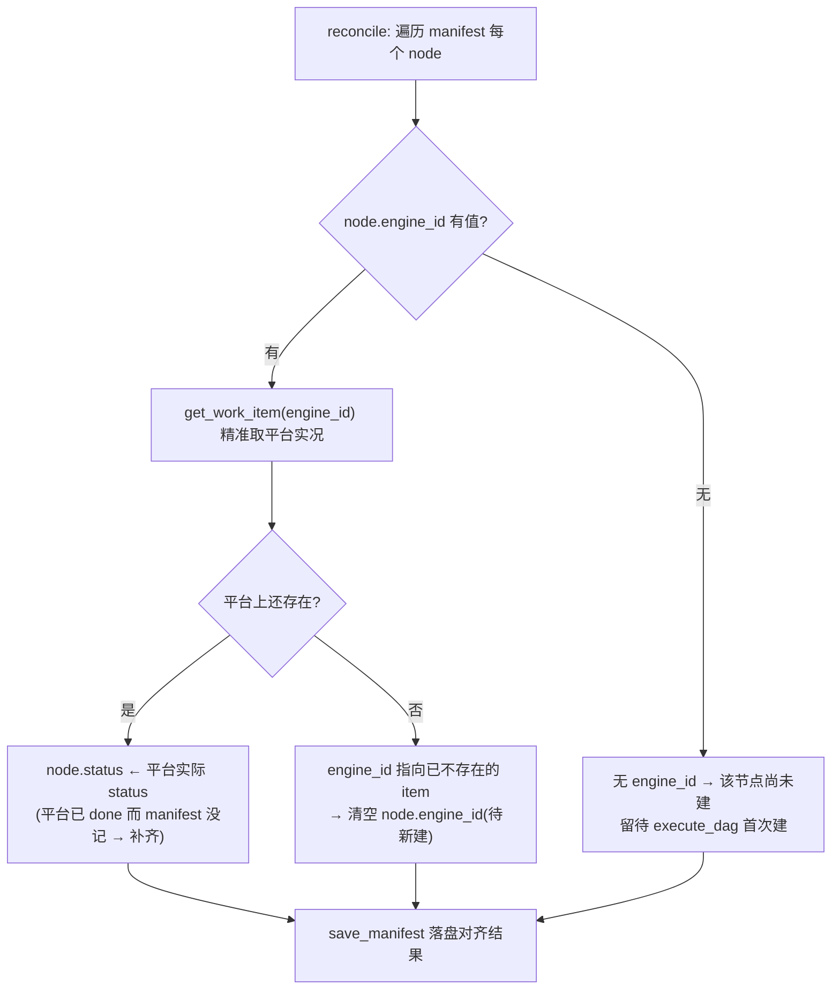
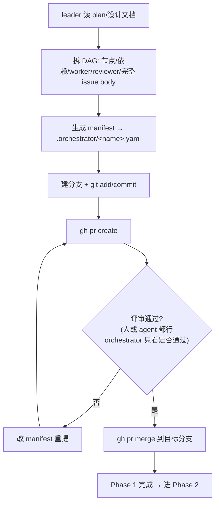
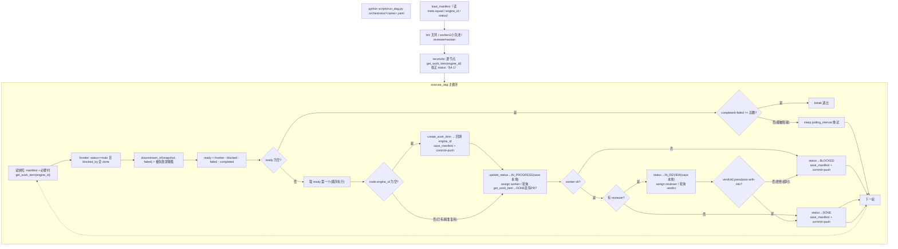
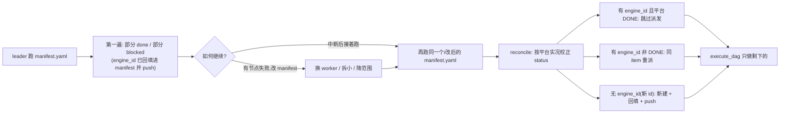
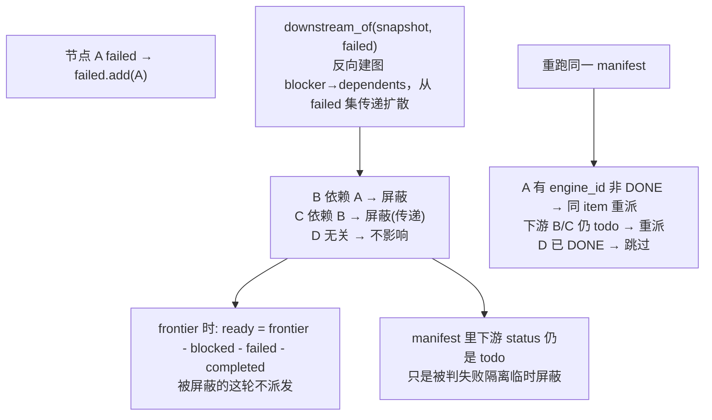
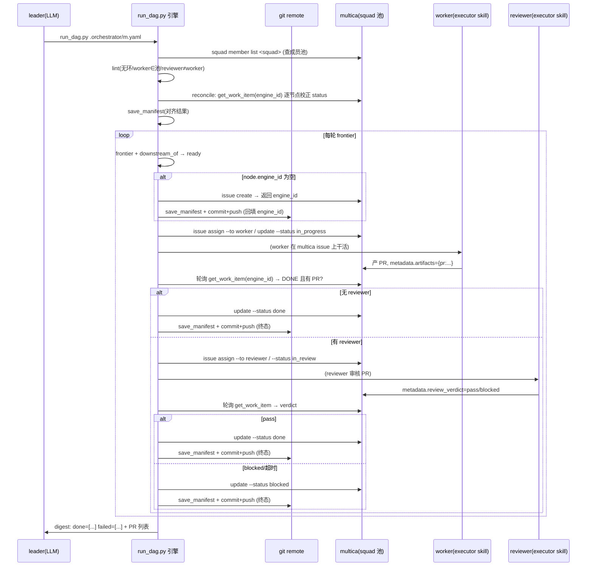

# parallel-dev-orchestration 执行机制与流程

> 本文是 orchestrator skill（`parallel-dev-orchestration`）的机制说明，配合 `scripts/` 下的编排引擎阅读。
> 目的：不读代码也能 get 到整个 DAG 是怎么被拆出来、跑起来、失败重试、幂等重跑的，以及每个状态是谁在什么时候更新的。
> 配套的 worker/reviewer 执行协议在 `parallel-dev-executor` skill。
>
> ⚠️ **本文已更新为目标设计：manifest 作为全局唯一口径**（对应 `REDESIGN-manifest-source-of-truth.md`）。
> **代码实现尚在推进中**——当前 `scripts/` 仍是旧实现（checkpoint / Run 存储 / `find_work_item_by_dag_key` 全量扫）。
> 下文描述的是**目标机制**；待重构落地后，代码行为与本文对齐。

---

## 0. 核心思想（先看这个）

**manifest 文件 = 全局唯一口径。** 任何人/任何机器只要看 `.orchestrator/<name>.yaml`，就知道这张任务图的最新状态：每个节点派给谁、依赖谁、在平台上对应哪个 work item（`engine_id`）、当前什么状态（`status`）。

由此推导出两条铁律：

1. **双 ID 钉死映射**：每节点有 `dag_key`（orchestrator 生成，写进 manifest）+ `engine_id`（平台建完 work item 返回，**回填进 manifest**）。有 `engine_id` 就能 `get_work_item(engine_id)` 精准取，不必再扫平台。
2. **状态写回 manifest + 关键节点 commit+push**：节点状态变更实时写回 manifest 文件；`engine_id` 回填、节点进终态这两类关键节点 `git commit+push`，让别的机器/平台能凭 manifest 反查、接力。

不再需要 checkpoint、不再需要 Run 存储、不再需要全量扫——**manifest 自己就是实时维护的状态账本**。

---

## 1. 三个角色与边界

| 角色 | 载体 | 职责 | 不做什么 |
|------|------|------|----------|
| **leader** | `parallel-dev-orchestration` skill 正文（LLM 动态） | 拆 manifest DAG、**生成 manifest 到 `.orchestrator/` 并走 PR 评审门**、决策失败、改 manifest 重跑、收尾 | 不写循环、不派单、不写派发判定 |
| **编排引擎** | `scripts/run_dag.py` + `scripts/core/` + `scripts/engines/`（确定性代码） | lint、reconcile 校验、建 work item + **回填 engine_id**、编译 metadata、算 frontier、派发、轮询、失败隔离、**写回 manifest + commit+push** | 不决策「换谁」「拆多大」、不自动 merge |
| **worker / reviewer** | `parallel-dev-executor` skill（LLM 动态） | 在协作平台（multica/github）上执行被派的 issue，产 PR、走审核、回写产物/verdict | 不改 manifest、不调度别人 |

一句话：**引擎只做确定性的事（建/派/轮询/标状态/隔离/回写 manifest），leader 只做动态判断（拆解、失败决策、改 manifest），worker 只做被派的活。**

唯一的 CLI 入口是 `python scripts/run_dag.py <manifest>`。leader 不直接操作底层引擎 CLI（multica / gh）——那些封在引擎里；唯一例外是 Phase 1 的 manifest PR，由 leader 直接跑 `gh`（见 §5）。

---

## 2. 核心数据模型

### 2.1 双 ID：一个 DAG 节点 = manifest 一个 node = 平台一个 work item

| 概念 | 是什么 | 谁生成 | 落在哪 |
|------|--------|--------|--------|
| `dag_key` | manifest 节点 id（如 `jwt-service`） | orchestrator 拆图时 | manifest（`node.id`） |
| `engine_id` | 平台 work item 实际 id（multica issue id / GitHub issue 号） | 平台 `create_work_item` 返回 | **Phase 2 回填进 manifest（`node.engine_id`）** |

两个 id 都钉在 manifest 里——这就是「不必再单独维护 dag_key↔平台 issue 对应关系」的原因。

WorkItem（引擎内存对象，对应平台一条 issue）和流程强相关的字段：

- `id`：即 `engine_id`，平台实际 id
- `dag_key`：对应的 manifest 节点 id
- `worker` / `reviewer`：派给谁
- `blocked_by`：DAG 依赖（其它节点的 dag_key 列表）
- `artifacts`：worker 回写的产物，如 `{"pr": "https://.../pull/123"}`——**是否有 PR 是完成判定的硬条件**
- `review_verdict`：reviewer 回写，`pass` / `pass-with-nits` / `blocked` / `needs-changes`
- `status`：见状态机

### 2.2 WorkItem 状态机

```
                 ┌──────────────────────────────────────────┐
                 ▼                                          │
  TODO  ──assign worker──▶  IN_PROGRESS  ──worker 跑完+有PR──▶ 无 reviewer：DONE
                                │                          │
                                │ worker 失败              │ 有 reviewer
                                ▼                          ▼
                              FAILED(瞬态)              IN_REVIEW ──assign reviewer──▶ 轮询 verdict
                                │                                       │
                                │ 引擎判定失败                        ├─ pass / pass-with-nits ─▶ DONE
                                ▼                                       └─ blocked / needs-changes / 超时 ─▶ BLOCKED
                              BLOCKED ◀──引擎标(失败隔离)
```

**关键区分**：

- `DONE` = 成功终态。是幂等里「**复用、跳过派发**」的唯一判定状态。
- `BLOCKED` = 失败终态（引擎标）。下游被一并失败隔离。重跑时视为「非 DONE → 重派」。
- `FAILED` 是 worker 自己报的瞬态，引擎拿到后转 `BLOCKED` 计入 failed——落账的失败终态是 `BLOCKED`。
- `IN_PROGRESS` / `IN_REVIEW` 是在飞态，frontier 不算 ready，重跑时归「非 DONE → 重派」。

> 每个节点的 `status` **既写在平台 issue 上，也写回 manifest 的 `node.status`**——平台是实况、manifest 是口径，二者由 reconcile（§4）对齐。

### 2.3 Manifest 就是记录（没有 Run、没有 checkpoint）

manifest 文件本身承载全部状态，节点字段：

| 字段 | 含义 | 何时写 |
|------|------|--------|
| `id`（dag_key） | 节点唯一标识 | 拆图时（orchestrator） |
| `worker` / `reviewer` | 派发对象 | 拆图时 |
| `blocked_by` | 依赖的 dag_key 列表 | 拆图时 |
| `description` | **完整 issue body**（worker 的上下文来源） | 拆图时 |
| `engine_id` | 平台 work item id | **Phase 2 建完回填**（缺省 `null`） |
| `status` | 节点当前状态 | **Phase 2 实时写回**（缺省 `todo`） |

- `meta.squad`：派发小队（成员池与派发作用域）；`meta.name`：本次任务名。
- `completed / failed` 不再单独存——由 manifest 里各节点 `status` 推导（`status==done` 即 completed）。
- 没有 `dag-<时间戳>` 的 run_id，没有 `.multica_state/`，没有 `checkpoint.json`。

---

## 3. 状态更新点（谁、什么时候、改什么、要不要 push）

所有写操作都是引擎在 `execute_dag` / `reconcile` 里做的；worker/reviewer 只回写平台 issue 的 `artifacts` 和 `review_verdict`，状态标定权在引擎。**「写 manifest」= 调 `save_manifest` 落本地文件；「commit+push」= 关键节点额外 `commit_manifest`。**

| 时机 | 操作 | 状态变化 | 写 manifest | commit+push? |
|------|------|----------|------------|--------------|
| reconcile 启动校验 | `get_work_item(engine_id)` 对齐平台实况 | `node.status` ← 平台实况，补 gap | 是（落盘一次） | 否（除非纠正了 engine_id） |
| 节点首次派发（`engine_id` 为空） | `create_work_item` → 回填 `node.engine_id` | → `TODO` | 是 | **是**（钉死映射） |
| 派发 worker 前 | `update_status`（平台） | `TODO`→`IN_PROGRESS` | 是（本地） | 否 |
| worker `DONE` 且有 PR 产物 | 判定成功（无 reviewer） | → `DONE` | 是 | **是**（终态） |
| worker 缺 PR / 报 `FAILED` | 判定失败 | → `BLOCKED` | 是 | **是**（终态） |
| 派发 reviewer 前 | `update_status` | →`IN_REVIEW` | 是（本地） | 否 |
| reviewer `pass`/`pass-with-nits` | 通过 | → `DONE` | 是 | **是**（终态） |
| reviewer `blocked`/`needs-changes`/超时 | 拒绝 | → `BLOCKED` | 是 | **是**（终态） |
| 任一失败发生 | 失败隔离 | `downstream_of(failed)` 下游本轮屏蔽（懒计算，不写库） | 否 | 否 |

要点：

- **commit+push 只发生在两类关键节点**：①engine_id 回填；②节点进终态（done/blocked）。中间在飞态（in_progress/in_review）只 `save_manifest` 落本地，不 push——避免 git 噪音。
- 「失败隔离」不是把下游永久写死 blocked，而是**每轮算 frontier 时用 `downstream_of(snapshot, failed)` 动态算「这轮被屏蔽的集合」**：依赖了 failed 的、传递依赖的，从 ready 剔除；它们的 `status` 仍是原样，下轮/重跑照常可派。
- `commit_manifest` 失败（如 push 被拒）**醒目告警但不中断编排**——本地 manifest 仍是最新，跨机器口径会滞后，提示人工补推。

---

## 4. 幂等去重现在怎么工作（manifest.engine_id + 精准 get + reconcile）

旧实现靠 `find_work_item_by_dag_key` 全量拉平台 issue 再扫 metadata/title（O(n)、每轮扫）。**新模型把映射钉在 manifest，改成精准取**：

### 4.1 reconcile —— Phase 2 启动的全局幂等检查与状态校验

manifest 可能是**别的机器 commit 来的、带部分状态**（例：本机 orchestrator 跑挂，手动 commit 已更新部分状态的 manifest，另一台机器接力）。所以跑 DAG 前先逐节点对齐：



reconcile 完，`completed = {status==done 的节点}`、`failed = {blocked/failed 的节点}`，作为 `execute_dag` 的起跑种子——**这取代了旧的 checkpoint 种子**。

### 4.2 跑/重跑时的精准判定

`execute_dag` 处理每个节点：

- `node.engine_id` 有值 → `get_work_item(engine_id)` **直接 O(1) 取**：
  - `status==DONE` → 复用，跳过派发；
  - 非 DONE → 复用同一 `engine_id` 重新派发（不另建，避免孤儿 issue）。
- `node.engine_id` 为空 → 平台还没这个节点 → `create_work_item` 新建 → 回填 `engine_id` → `save_manifest` + **commit+push**。

判定口径一句话：**manifest 里有没有 `engine_id`、平台上那个 item 是不是 `DONE`**——不再扫平台、不再查 dag_key。

- 同一 manifest 重跑：已 done 的节点有 engine_id 且平台 done → 跳过；非 done 的重派。
- leader 改了某失败节点的 `worker` 但 `id`/`engine_id` 不变 → 命中同 item，状态非 DONE → 重派。
- leader 把节点拆成新 `id`（无 engine_id）→ 新建。
- 全新 DAG：所有节点都没 engine_id → 全量新建。

---

## 5. 顶层流程图（两个阶段）

### Phase 1 — 拆 DAG + manifest PR 评审门



> manifest 必须含**完整 issue body**（`description`）——worker 领到 issue 后的上下文全靠它。

### Phase 2 — 跑 DAG（run_dag.py）



对比旧实现：没有 `create_run`、没有 `_save_checkpoint`/`_load_checkpoint` 倒手；状态直接落 manifest，关键节点 commit+push。

---

## 6. 幂等重跑 = 断点续跑 = 失败重试（同一条路径）

**没有 `--resume`，没有「续跑绑死旧 run_id」。** 任何重跑都是再跑一次同一个 manifest。



跨机器接力：A 机跑了一半，`git push` 了带部分 `engine_id`/`status` 的 manifest；B 机 `git pull` 后跑同一 manifest，reconcile 拿 engine_id 去平台核对，补齐 gap，接着跑——**manifest 是唯一口径，平台是实况，二者对齐**。

---

## 7. 失败隔离细节



要点：

- 失败隔离**每轮动态算**（`downstream_of` 传 `failed` 集），不把下游 status 永久写死 blocked。
- 被隔离的下游 status 仍是 `todo`，重跑按「非 DONE」走，不会卡死。
- 无关独立分支照常推进（`graph.py` 的 `downstream_of` 守这条）。

---

## 8. multica / mock 引擎具体落地

> 目标态：**mock 与 multica 都是一等公民**，`test_run_dag_e2e.py` 要求两引擎都跑通完整 run-DAG 核心流程（multica 用 fake CLI 接入，不依赖真实服务）。旧实现里 multica 的 `create_run/get_run/...` 桩在新模型中**已删除**（Run 存储不再存在）。

### 8.1 workspace vs squad（易混点）

- `workspace_id`：顶层工作空间，**走引擎 env / 配置**（`MULTICA_WORKSPACE_ID`），不写在 manifest。定位「在哪个空间建 issue / 找成员」。
- `squad_id`：工作空间内的小队，**来自 manifest 的 `meta.squad`**。派发与成员池都限定在这个小队。

multica CLI 的全局 `--workspace-id` 在 `_run_multica` 里固定插入到 `multica` 和子命令之间：
```
multica --workspace-id <workspace_id> <subcommand> ...
```

### 8.2 引擎接口 → multica 命令映射（收敛后）

| 引擎接口 | multica 落地 |
|----------|--------------|
| `list_members(squad_id)` | `multica squad member list <squad-id>`（fallback `agent list`） |
| `create_work_item` | `multica issue create` + `metadata set`（dag_key/worker/reviewer/blocked_by）→ **返回 issue id 作为 engine_id** |
| `get_work_item(engine_id)` | `multica issue get <engine_id>` → 解析 metadata（**主查询，精准取**） |
| `update_status` | `multica issue update --status ...` |
| `assign_work_item` | `multica issue assign --to <agent_id>` + 更新 metadata role |
| `update_work_item_metadata` | `multica issue metadata set`（artifacts/verdict 等） |
| `add_comment` | `multica issue comment` |
| `list_work_items` | `multica issue list`（仅供进度/调试，不再用于幂等查询） |

> **回写 manifest + commit+push 不在引擎接口里**——那是 `run_dag.py` 的 `save_manifest` / `commit_manifest`（git 操作），与具体引擎无关。
> **已删除**：`find_work_item_by_dag_key`（被 manifest.engine_id + `get_work_item` 取代）、`create_run/get_run/list_runs/delete_run`、`_save_checkpoint/_load_checkpoint`、`_log_event`。

### 8.3 一次 multica 真跑的时序



---

## 9. 与 executor skill 的衔接

- 引擎把 `issue` 派给 worker 后，**worker 怎么执行、TDD、产 PR、写 metadata 证据**，是 `parallel-dev-executor` skill 的协议。
- 引擎只认两样回写：`status`（最终到 `DONE`/`FAILED`）和 `metadata.artifacts`（有没有 PR）。reviewer 同理只认 `metadata.review_verdict`。
- orchestrator 和 executor 靠**协作平台上的 issue metadata 字段契约**对接，不是函数调用。**本次重构不动 executor 侧**——worker/reviewer 仍从平台 issue 读 body/metadata、回写产物/verdict。

---

## 10. 验证口径（目标测试集）

> 以下是**目标态**的测试覆盖（对应 REDESIGN §E）；当前 `scripts/tests/` 仍是旧 19 项，重构落地时一并替换。

- `test_graph.py`：frontier / downstream_of 纯算法——含「健康分支不受失败影响仍 ready」「传递下游被屏蔽」。
- `test_manifest_roundtrip.py`（新）：`save_manifest`→`load_manifest` 保真（engine_id/status/依赖/body 不丢）；`set_node` 只改指定字段。
- `test_engines.py`（改）：删 `find_work_item_by_dag_key` 用例，加 `get_work_item(engine_id)` 精准取用例（mock + multica）。
- **`test_run_dag_e2e.py`（新，核心）**：对 **mock 和 multica 两引擎**各跑通 `start_new_run`（load→lint→reconcile→execute_dag）完整链路，断言：① A→B 跑到全 done；② manifest 回填 engine_id、status=done；③ 关键节点触发 commit+push；④ 重跑 0 新建、精准 `get_work_item(engine_id)` 复用；⑤ B 改回 blocked 重跑只重做 B。multica 经 fake CLI 接入。
- **reconcile 测试**：manifest 记 engine_id 但 status 落后于平台 → 补成 done；engine_id 指向不存在 item → 清空待新建（mock + multica）。

核心价值：端到端真正覆盖「跑 DAG 图核心全流程」，且 mock 与 multica 必须都跑通——而非旧版只在 mock 上验单点。

---

## 11. 一句话总结

> **manifest 文件就是全局唯一口径**：每节点的 `dag_key`+`engine_id`+`status` 都钉在里面，关键节点 commit+push，任何机器看 manifest 即知最新态。跑哪个 manifest，有 `engine_id` 且平台 `DONE` 的节点就永不重派，其余精准复用同 item 重派——靠 `get_work_item(engine_id)` O(1) 命中，不再扫平台、不再要 checkpoint。失败重试、断点续跑、跨机器接力，都是同一句 `python scripts/run_dag.py <manifest>`：引擎管确定性调度（reconcile/建/复用/派发/轮询/隔离/回写 manifest），leader 管动态判断（拆解、PR 评审门、失败决策、改 manifest），worker/reviewer 管被派的活并把 PR 和 verdict 回写到 issue metadata。
